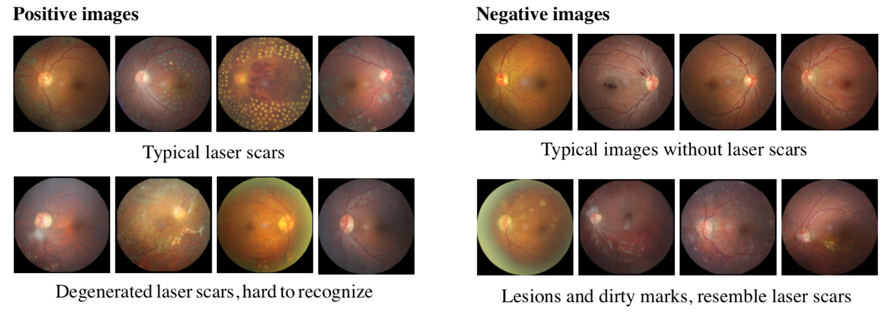

# Fundus10K

Fundus10K, containing 10,861 expert-labeled color fundus images, is so far the largest image collection for training and evaluating laser scar detection algorithms. Concerning data sources, the dataset consists of 9,864 images from the [Kaggle Diabetic Retinopathy Detection challenge](https://www.kaggle.com/c/diabetic-retinopathy-detection) and 997 images from our hospital partners. 



Basic statistics of Fundus10K are summarized as:

| | Training (70%) | Validation (10%) | Testing (20)% |
| :--   | --: | --:  | --:  |
| # Images | 7,602 | 1,086 | 2,173 | 49 |
| # Images from Kaggle | 6,903 | 987 | 1,974|
| # Images with laser scars | 282 | 42 | 80 | 

## Downloads

* [Version 1: image size 448x448](http://lixirong.net/data/accv2018/laser_scar_dataset_448.zip), released on Nov-28-2018: We provide 1) binary labels indicating whether a fundus image has laser scars visible, and 997+80 images with a resolution of 448x448. For the kaggle images, please download them from the [Kaggle](https://www.kaggle.com/c/diabetic-retinopathy-detection) website.

## State-of-the-art 

### Performance on Test2k

| Model | Sensitivity | Specificity | Precision | AP | AUC |
| :-- | --: | --: | --: | --: | --: | 
| DenseNet-Ensemble | 0.950 | 0.999 | 0.974 | 0.988 | 0.999 | 

### Performance on Test2k+

| Model | Sensitivity | Specificity | Precision | AP | AUC |
| :-- | --: | --: | --: | --: | --: | 
| DenseNet-Ensemble | 0.925 | 0.999 | 0.987 | 0.983 | 0.998 | 

## Reference

If you find the dataset useful, please consider citing the following paper:

```
@inproceedings{accv2018-laser-scar-detection,
title = {Laser Scar Detection in Fundus Images using Convolutional Neural Networks},
author = {Qijie Wei and Xirong Li and Hao Wang and Dayong Ding and Weihong Yu and Youxin Chen},
year = {2018},
booktitle = {Asian Conference on Computer Vision (ACCV)},
}
```
